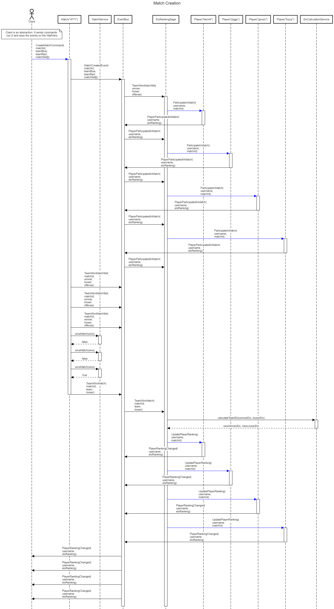

# Ranked

Application for tracking table-soccer results.

## Running

### Local

Use spring profile "local"

* start the h2Application (from `/test/h2`)
* start the RankedApplication (from `backend/application`)

* create new Match using the form on [http://localhost:8081/](http://localhost:8081/) or using [Swagger](http://localhost:8081/swagger-ui.html). 

### Docker

* run `docker-compose up --build`

Depending on your os, you might have to replace `localhost` with your `DOCKER_IP` for all given urls.

## Side Goals

- Learning of SpringBoot with Kotlin
- Learning of CQRS, Event Sourcing with AxonFramework
- Learning ReactJS frontend technology

## Ideas and Requirements

- As a player, I want to enter the results of the match
- As a player, I want to use chat bot for entering the data
- As a player, I want to have a classic UI for entering data
- As a player, I want to know my global ranking (elo-based)
- As a player, I want to know my ranking over the last year

## Development and architecture

We have several input channels and currently unknown algorithms to calculate on data and represent UI. In the same time, 
we know the target domain very well, so we foster domain-driven design and start with CQRS ES architecture style.
Every target algorithm is a separate view on the domain, implemented by a view-projection on the event stream.

We use the following stack:

- SpringBoot 2
- Kotlin
- AxonFramework 3

## Decisions

### Components and project structure

We came up with the following components and project structure for our application. The application is separated into 
`frontend`, `backend`, `test` and `extensions` modules.

#### Backend

The core CQRS application with all the business logic and even sourcing.
Command and Query components are separate modules, but not separated applications, they share a common bus.  

- The `backend/application` is a component responsible for launching the entire application. It has dependencies to all other 
components and works as a packaging module for SpringBoot. 
- The `backend/command` component contains the core/command part of the CQRS application. It holds the aggregates and the commands and uses AxonFramework.
- The `backend/elo` contains the business logic needed to do elo calculation
- The `backend/model` component contains the value objects (Player, Team, etc) and the Event-Objects since they are shared between the `command` and the View-components.
- The `backend/properties` component holding the properties definition for the entire project.
- There are a bunch of View-Components, each responsible for a specific use case. The views have no persistence and act as tracking event processors on the stream 
of events stored in the event store of the application. 
  - The `backend/view/wall-view` component is displaying the information about played matches. It is comparable with the facebook wall displaying news.
  - The `backend/view/leaderboard-view` component is calculating the best players and displays those.
  - The `backend/view/player-view` component encapsulates information about players available in the system.
  
#### Frontend

The `frontend` component contains the ReactJS single page application. Its build process is based on `npm` and `webpack` and is integrated into the 
Apache Maven component build. If you want to skip the frontend build, please use the following command:

        mvn clean install -P \!frontend

#### Test

- The `test/h2` is a h2 instance used during development. It provides a in-memory database which can be connected to using the tcp-socket.

#### Extensions

Library that provides kotlin-extension functions for Java, Spring and Axon.
Expect this to be maintained and released separately.

### CQRS runtime view

CQRS software design is different from classic OO/CRUD design with shared state. In order to depict this, the following diagramm
has been created:
 
 

The diagram has been created using the [https://sequencediagram.org/](https://sequencediagram.org/)
and the diagram script is located in `docs/sequencediagramm.org.txt`.

  
### API

There are two APIs of the application. The Command API is responsible for accepting user inputs (like recording new matches played). The View API is
offering different views on application data (just following the CQRS pattern). Both APIs are RESTful APIs. If you want explore them, you can use Swagger,
shipped as a part of the application. Just navigate to [http://localhost:8081/swagger-ui.html](http://localhost:8081/swagger-ui.html) and choose the 
API you want to see in the drop-down menu at the top-right of the screen.

The entire Command API is offered under `/command` resource. The entire View API is offered under `/view` resource. 

#### Endpoints

A Zuul proxy is configured in a way, that it redirects the requests to the frontend (port 8080) to the backend (8081) for the following URLs

- http://localhost:8080/command/match

- http://localhost:8080/view/wall/players
- http://localhost:8080/view/wall/matches
- http://localhost:8080/view/wall/teams
- http://localhost:8080/view/user
- http://localhost:8080/view/user/{id}

### Example REST Requests

Currently, we support two ways of submitting the created match. In both cases, the match must contain information about the played sets. There are two possibilities to do
so. Either you just provide the result of the set by specifying the number of goals shot by every team or you can provide a collection of goals with information which team scored and a timestamp.

Here is an example request for publishing the results only. Please note the `type: result` attribute:

      {
        "matchId": "4711",
        "teamRed": {
          "player1": {
            "value": "foo1"
          },
          "player2": {
            "value": "bar1"
          }
        },
        "teamBlue": {
          "player1": {
            "value": "zee1"
          },
          "player2": {
            "value": "onk1"
          }
        },
        "matchSets": [
          {
            "type": "result",
            "goalsRed": 6,
            "goalsBlue": 0,
            "offenseBlue": {
              "value": "onk1"
            },
            "offenseRed": {
              "value": "foo1"
            }
          },
          {
            "type": "result",
            "goalsRed": 6,
            "goalsBlue": 0,
            "offenseBlue": {
              "value": "onk1"
            },
            "offenseRed": {
              "value": "foo1"
            }
          }
      
        ],
        "tournamentId": "string",
        "startTime": [2018,1,19,20,49,48]
      }
      
Here is an example request for publishing the goals with timestamps. Please note the `type: timestamp` attribute:

      {
        "matchId": "4712",
        "teamRed": {
          "player1": {
            "value": "foo1"
          },
          "player2": {
            "value": "bar1"
          }
        },
        "teamBlue": {
          "player1": {
            "value": "zee1"
          },
          "player2": {
            "value": "onk1"
          }
        },
        "matchSets": [
          {
            "type": "timestamp",
            "goals": [
              {"first":"RED","second":[2018,1,19,20,49,48]},
              {"first":"BLUE","second":[2018,1,19,20,49,51]},
              {"first":"RED","second":[2018,1,19,20,50,15]},
              {"first":"BLUE","second":[2018,1,19,20,52,48]},
              {"first":"RED","second":[2018,1,19,20,53,17]},
              {"first":"BLUE","second":[2018,1,19,20,55,21]},
              {"first":"RED","second":[2018,1,19,20,59,1]},
              {"first":"RED","second":[2018,1,19,21,1,2]},
              {"first":"RED","second":[2018,1,19,21,2,57]}
            ],
            "offenseBlue": {
              "value": "onk1"
            },
            "offenseRed": {
              "value": "foo1"
            }
          },
          {
            "type": "timestamp",
            "goals": [
              {"first":"RED","second":[2018,1,19,20,49,48]},
              {"first":"BLUE","second":[2018,1,19,20,49,51]},
              {"first":"RED","second":[2018,1,19,20,50,15]},
              {"first":"BLUE","second":[2018,1,19,20,52,48]},
              {"first":"RED","second":[2018,1,19,20,53,17]},
              {"first":"BLUE","second":[2018,1,19,20,55,21]},
              {"first":"RED","second":[2018,1,19,20,59,1]},
              {"first":"RED","second":[2018,1,19,21,1,2]},
              {"first":"RED","second":[2018,1,19,21,2,57]}
            ],
            "offenseBlue": {
              "value": "onk1"
            },
            "offenseRed": {
              "value": "foo1"
            }
          }      
        ],
        "tournamentId": "string",
        "startTime": [2018,1,19,20,49,48]
      }

### Test framework

Though using plain `junit/assertj` unit tests would be possible, we want to try the kotlin way.

## History

Wait... Last time I was here you spoke about implementing it in Scala. Right, the initial idea was to implement the application 
in Scala using the JEE stack. This idea has remained idea after the prototype implementation of basic aspects like persistence with JPA, 
some JEE Beans and controllers. After several years, we decided to try it again...

If you are still interested, check out the [legacy-scala](https://github.com/holisticon/ranked/tree/legacy-scala) branch.

## Team

- Simon Zambrovski
- Jan Galinski
- Timo Gröger
- Daniel Wegener

